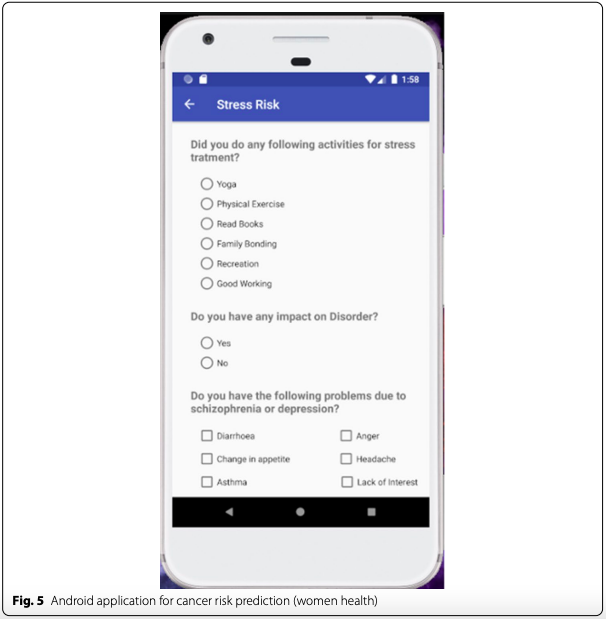

# Cancer risk prediction app
The risk prediction app will be found in the folder `Deadly-Cancer-Prediction`.

The questionnaire is set based on the findings of the paper.

It calcuates with the model and predicts the risk.

The defined algorithm used to determine the risk,

